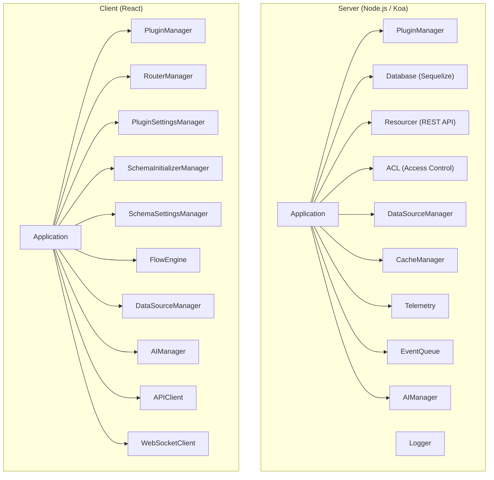
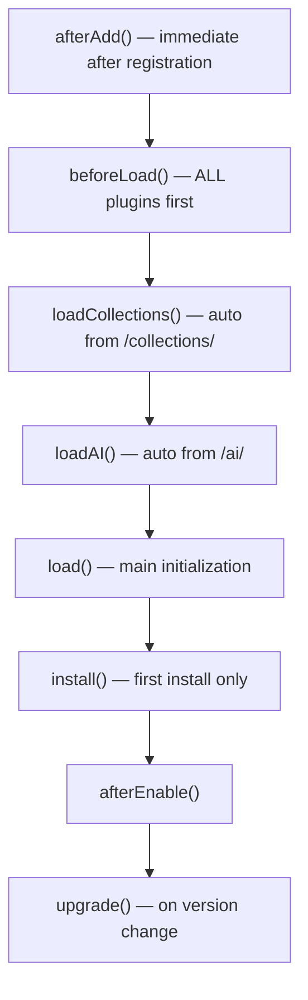
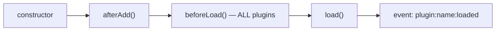
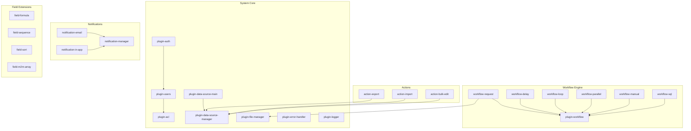
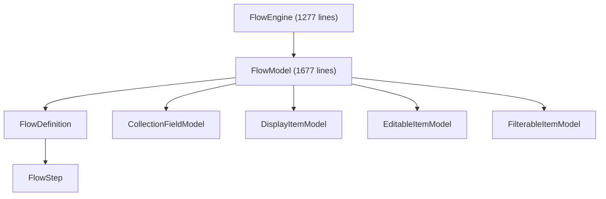

# NocoBase Plugin Developer Skill

Expert guide for developing NocoBase plugins. Covers full-stack architecture, all plugin categories, core module integration, and real-world patterns from 89+ built-in plugins.

---

## 1. NocoBase Application Architecture



### Core Modules (packages/core/)

| Module | Path | Purpose |
|---|---|---|
| `@nocobase/server` | `core/server` | Koa app, Plugin base, PluginManager, Resourcer |
| `@nocobase/client` | `core/client` | React app, Plugin base, PluginManager, UI managers |
| `@nocobase/database` | `core/database` | Sequelize wrapper, Collection, Field, Repository |
| `@nocobase/utils` | `core/utils` | Shared utilities, Registry, uid, i18n |
| `@nocobase/acl` | `core/acl` | Access control list, role, permission |
| `@nocobase/cache` | `core/cache` | Cache manager (Redis/in-memory) |
| `@nocobase/logger` | `core/logger` | Winston-based logging |
| `@nocobase/data-source-manager` | `core/data-source-manager` | Multi data-source management |
| `@nocobase/flow-engine` | `core/flow-engine` | Model-based UI logic engine |

---

## 2. Plugin Categories & Patterns

NocoBase has 89+ plugins organized by category. Each follows specific architectural patterns.

### Plugin Categories Map

| Category | Prefix | Pattern | Examples |
|---|---|---|---|
| **Field** | `plugin-field-*` | Register field type in `beforeLoad()` | formula, sequence, sort, m2m-array |
| **Block** | `plugin-block-*` | Register UI block component | iframe, markdown, grid-card, list, workbench |
| **Action** | `plugin-action-*` | Register action handler | export, import, bulk-edit, bulk-update, duplicate, print |
| **Workflow** | `plugin-workflow-*` | Extend workflow with triggers/instructions | request, delay, loop, parallel, manual, aggregate |
| **Data Source** | `plugin-data-source-*` | Manage collection schemas & sources | main, manager |
| **Notification** | `plugin-notification-*` | Register channel types | manager, email, in-app-message |
| **Auth** | `plugin-auth*` | Register auth providers | auth, auth-sms |
| **System** | `plugin-*` | Core functionality | acl, users, file-manager, error-handler, logger |
| **Collection** | `plugin-collection-*` | Extended collection types | sql, tree |
| **UI** | `plugin-ui-*` | UI schema management | schema-storage, templates |

---

## 3. Project Structure

```
plugin-my-feature/
├── package.json          # peerDependencies for load ordering
├── client.d.ts           # Re-export: export * from './dist/client';
├── client.js             # Re-export: module.exports = require('./dist/client');
├── server.d.ts           # Re-export: export * from './dist/server';
├── server.js             # Re-export: module.exports = require('./dist/server');
├── src/
│   ├── index.ts           # Root: export * from './server'; export { default } from './server';
│   ├── locale/            # i18n: en-US.json, zh-CN.json
│   ├── client/
│   │   ├── index.tsx      # Client plugin class
│   │   ├── components/    # React components
│   │   └── hooks/         # React hooks
│   └── server/
│       ├── index.ts       # Server entry: exports default + namespace
│       ├── plugin.ts      # Server plugin class
│       ├── collections/   # Auto-loaded collection definitions
│       ├── actions/       # Custom action handlers
│       ├── models/        # Custom Sequelize Model classes
│       ├── repositories/  # Custom Repository classes
│       └── migrations/    # Database migrations
```

### package.json Convention

```json
{
  "name": "@myorg/plugin-my-feature",
  "version": "1.0.0",
  "main": "./dist/server/index.js",
  "peerDependencies": {
    "@nocobase/client": "2.x",
    "@nocobase/server": "2.x",
    "@nocobase/database": "2.x",
    "@nocobase/test": "2.x"
  }
}
```

> [!IMPORTANT]
> `peerDependencies` control **topological sort** during plugin loading. If Plugin B depends on Plugin A, add `"@nocobase/plugin-a": "2.x"` to Plugin B's `peerDependencies` so A loads first. This uses `@hapi/topo` for ordering.

### Entry Points

```typescript
// src/server/index.ts
// @ts-ignore
import { name } from '../../package.json';
export { default } from './plugin';
export const namespace = name;

// src/index.ts
export * from './server';
export { default } from './server';
```

---

## 4. Server-Side Architecture

### Plugin Base Class (from `@nocobase/server`)

#### Key Properties

| Property | Type | Purpose |
|---|---|---|
| `this.app` | `Application` | Koa application with all managers |
| `this.db` | `Database` | Sequelize ORM wrapper (1146 lines, 92 methods) |
| `this.pm` | `PluginManager` | Access other plugins via `this.pm.get()` |
| `this.log` | `Logger` | Plugin-scoped Winston logger |
| `this.name` | `string` | Plugin name |
| `this.ai` | `AIManager` | AI tool registration |
| `this.options` | `any` | Plugin configuration options |
| `this.enabled` | `boolean` | Whether plugin is enabled |
| `this.installed` | `boolean` | Whether plugin is installed |

#### Lifecycle Hooks (Execution Order)



> [!NOTE]
> **Two-Pass Loading**: `PluginManager.load()` calls `beforeLoad()` on ALL plugins FIRST, then iterates again calling `loadCollections()` + `load()` on each. This guarantees global registration (models, operators, field types) runs before any plugin's `load()`.

#### Loading Order
1. **Preset plugins** — from `@nocobase/preset-nocobase` `builtIn` array (55 plugins)
2. **Database plugins** — from `applicationPlugins` table, sorted by `peerDependencies`

---

## 5. Plugin Patterns by Category (Real Examples)

### 5.1 Field Plugin Pattern

Field plugins register custom field types in `beforeLoad()` using `db.registerFieldTypes()`.

**Real Example: `plugin-field-formula`** (43 lines)

```typescript
import { Plugin } from '@nocobase/server';
import { resolve } from 'path';
import { FormulaField } from './formula-field';

export default class PluginFieldFormulaServer extends Plugin {
  beforeLoad() {
    // Register custom field type
    this.db.registerFieldTypes({
      formula: FormulaField,
    });

    // Register migrations
    this.db.addMigrations({
      namespace: this.name,
      directory: resolve(__dirname, './migrations'),
      context: { plugin: this },
    });
  }
}
```

**Real Example: `plugin-field-sequence`** — Uses Registry for pattern types

```typescript
import { Plugin } from '@nocobase/server';
import { Registry } from '@nocobase/utils';
import { SequenceField, Pattern } from './fields/sequence-field';

export default class PluginFieldSequenceServer extends Plugin {
  patternTypes = new Registry<Pattern>();

  async load() {
    this.db.registerFieldTypes({ sequence: SequenceField });

    await this.importCollections(path.resolve(__dirname, 'collections'));

    // Listen to field lifecycle events
    this.db.on('fields.beforeSave', async (field, { transaction }) => {
      if (field.get('type') !== 'sequence') return;
      // Auto-generate sequence keys...
    });

    this.db.on('fields.afterDestroy', async (field, { transaction }) => {
      // Cleanup sequence data...
    });
  }
}
```

> [!TIP]
> Field plugins that need database storage should use `this.importCollections()` and listen to `fields.beforeSave`/`fields.afterDestroy` events for setup/cleanup.

---

### 5.2 Action Plugin Pattern

Action plugins register handlers via `dataSourceManager.afterAddDataSource()` to work across ALL data sources.

**Real Example: `plugin-action-export`** (71 lines)

```typescript
import { Plugin } from '@nocobase/server';
import { exportXlsx } from './actions';
import { Logger } from '@nocobase/logger';

export default class PluginActionExportServer extends Plugin {
  logger: Logger;

  beforeLoad() {
    // Hook into afterInstall to modify roles
    this.app.on('afterInstall', async () => {
      const roles = await this.app.db.getRepository('roles').find({
        filter: { name: ['admin'] },
      });
      for (const role of roles) {
        await this.app.db.getRepository('roles').update({
          filter: { name: role.name },
          values: {
            strategy: {
              ...role.strategy,
              actions: [...role.strategy.actions, 'export'],
            },
          },
        });
      }
    });
  }

  async load() {
    this.logger = this.getLogger();

    // Register action handler for ALL data sources
    this.app.dataSourceManager.afterAddDataSource((dataSource) => {
      dataSource.resourceManager.registerActionHandler('export', exportXlsx.bind(this));
      dataSource.acl.setAvailableAction('export', {
        displayName: '{{t("Export")}}',
        allowConfigureFields: true,
        aliases: ['export', 'exportAttachments'],
      });
    });
  }

  getLogger(): Logger {
    return this.createLogger({
      dirname: 'action-export',
      filename: '%DATE%.log',
    });
  }
}
```

---

### 5.3 Workflow Plugin Pattern (Extension Architecture)

The workflow system uses a **Registry-based extension pattern** allowing other plugins to register custom triggers and instructions.

**Core: `plugin-workflow`** (561 lines) — Exposes extension APIs:

```typescript
import { Plugin } from '@nocobase/server';
import { Registry } from '@nocobase/utils';
import Trigger from './triggers';
import { InstructionInterface } from './instructions';

export default class PluginWorkflowServer extends Plugin {
  instructions: Registry<InstructionInterface> = new Registry();
  triggers: Registry<Trigger> = new Registry();
  functions: Registry<CustomFunction> = new Registry();

  // Public API: Register a new trigger type
  registerTrigger<T extends Trigger>(type: string, trigger: T | { new (p: Plugin): T }) {
    if (typeof trigger === 'function') {
      this.triggers.register(type, new trigger(this));
    } else {
      this.triggers.register(type, trigger);
    }
  }

  // Public API: Register a new instruction type
  registerInstruction(type: string, instruction: InstructionInterface | { new (p: Plugin): InstructionInterface }) {
    if (typeof instruction === 'function') {
      this.instructions.register(type, new instruction(this));
    } else {
      this.instructions.register(type, instruction);
    }
  }

  async load() {
    // Register built-in triggers
    this.registerTrigger('collection', CollectionTrigger);
    this.registerTrigger('schedule', ScheduleTrigger);

    // Register built-in instructions
    this.registerInstruction('calculation', CalculationInstruction);
    this.registerInstruction('condition', ConditionInstruction);
    this.registerInstruction('create', CreateInstruction);
    this.registerInstruction('query', QueryInstruction);
    this.registerInstruction('update', UpdateInstruction);
    this.registerInstruction('destroy', DestroyInstruction);
    // ... more built-in instructions

    // ACL snippets
    this.app.acl.registerSnippet({
      name: `pm.${this.name}.workflows`,
      actions: ['workflows:*', 'workflows.nodes:*', 'executions:list', /* ... */],
    });

    // Model event listeners
    this.db.on('workflows.beforeSave', this.onBeforeSave);
    this.db.on('workflows.afterCreate', this.onAfterCreate);

    // App lifecycle hooks
    this.app.on('afterStart', this.onAfterStart);
    this.app.on('beforeStop', this.onBeforeStop);

    // Event queue subscription (multi-instance)
    this.app.eventQueue.subscribe(this.channelPendingExecution, {
      idle: () => this.serving() && this.dispatcher.idle,
      process: this.dispatcher.onQueueExecution,
    });
  }
}
```

**Extension: `plugin-workflow-request`** — Implements a custom Instruction:

```typescript
import { Processor, Instruction, JOB_STATUS, FlowNodeModel, IJob } from '@nocobase/plugin-workflow';

export default class extends Instruction {
  // Run the instruction node
  async run(node: FlowNodeModel, prevJob, processor: Processor) {
    const config = processor.getParsedValue(node.config, node.id);
    const { workflow } = processor.execution;
    const sync = this.workflow.isWorkflowSync(workflow);

    if (sync) {
      const response = await request(config, this.workflow.app);
      return { status: JOB_STATUS.RESOLVED, result: responseSuccess(response) };
    }

    // Async: save pending job, exit processor, await response
    const { id } = processor.saveJob({
      status: JOB_STATUS.PENDING,
      nodeId: node.id,
      nodeKey: node.key,
      upstreamId: prevJob?.id ?? null,
    });
    await processor.exit();
    // ... handle async response and resume
  }

  async resume(node: FlowNodeModel, job, processor: Processor) {
    // Handle resumption from pending state
    return job;
  }

  async test(config) {
    // Test mode for debugging
    const response = await request(config, this.workflow.app);
    return { status: JOB_STATUS.RESOLVED, result: responseSuccess(response) };
  }
}
```

**Extension: `plugin-workflow-request` Plugin Entry** — Registration:

```typescript
import { Plugin } from '@nocobase/server';
import WorkflowPlugin from '@nocobase/plugin-workflow';
import RequestInstruction from './RequestInstruction';

export default class extends Plugin {
  async load() {
    const workflowPlugin = this.pm.get(WorkflowPlugin) as WorkflowPlugin;
    workflowPlugin.registerInstruction('request', RequestInstruction);
  }
}
```

---

### 5.4 Notification Plugin Pattern (Manager-Channel)

Uses a Manager class with pluggable Channel types.

**Core: `plugin-notification-manager`** (70 lines):

```typescript
import { Plugin } from '@nocobase/server';
import NotificationManager from './manager';
import { RegisterServerTypeFnParams, SendOptions, SendUserOptions } from './types';

export class PluginNotificationManagerServer extends Plugin {
  private manager: NotificationManager;

  get channelTypes() { return this.manager.channelTypes; }

  registerChannelType(params: RegisterServerTypeFnParams) {
    this.manager.registerType(params);
  }

  async send(options: SendOptions) {
    return this.manager.send(options);
  }

  async sendToUsers(options: SendUserOptions) {
    return this.manager.sendToUsers(options);
  }

  async afterAdd() {
    this.logger = this.createLogger({
      dirname: 'notification-manager',
      filename: '%DATE%.log',
      transports: ['dailyRotateFile'],
    });
    this.manager = new NotificationManager({ plugin: this });
  }

  async beforeLoad() {
    this.app.resourceManager.registerActionHandler('messages:send', async (ctx, next) => {
      this.manager.send(ctx.action?.params?.values);
      next();
    });
    this.app.acl.registerSnippet({
      name: 'pm.notification.channels',
      actions: ['notificationChannels:*'],
    });
  }
}
```

**Extension: `plugin-notification-email`** — Minimal (35 lines):

```typescript
import PluginNotificationManagerServer from '@nocobase/plugin-notification-manager';
import { Plugin } from '@nocobase/server';
import { MailNotificationChannel } from './mail-server';

export default class extends Plugin {
  async load() {
    const notificationServer = this.pm.get(PluginNotificationManagerServer);
    notificationServer.registerChannelType({
      type: 'email',
      Channel: MailNotificationChannel,
    });
  }
}
```

---

### 5.5 System Plugin Pattern — ACL (693 lines)

Heavy `beforeLoad()` with middleware, event listeners, and role management.

```typescript
export default class PluginACLServer extends Plugin {
  get acl() { return this.app.acl; }

  async beforeLoad() {
    // Register custom models
    this.db.registerModels({ RoleResourceModel, RoleResourceActionModel });

    // Register middleware
    this.app.resourceManager.use(setCurrentRole, { tag: 'setCurrentRole', before: 'acl' });

    // Listen to role/resource events (500+ lines of event handling)
    this.db.on('roles.afterSave', async (model, { transaction }) => {
      this.writeRoleToACL(model, { transaction });
    });

    this.db.on('rolesResourcesActions.afterUpdateWithAssociations', async (model, { transaction }) => {
      this.writeActionToACL(model, transaction);
    });

    // Wildcard collection definition listener
    this.db.on('afterDefineCollection', (collection) => {
      // Set default ACL for new collections
    });

    // Handle multi-instance sync
    this.app.on('afterStart', async () => {
      await this.writeRolesToACL();
    });
  }

  async install() {
    // Seed default roles: root, admin, member, guest
    const repo = this.db.getRepository('roles');
    await repo.createMany({
      records: [
        { name: 'root', title: '{{t("Root")}}' },
        { name: 'admin', title: '{{t("Admin")}}' },
        { name: 'member', title: '{{t("Member")}}', default: true },
      ],
    });
  }

  // Multi-instance sync
  async handleSyncMessage(message) {
    if (message.type === 'updateRole') {
      const role = await this.db.getRepository('roles').findOne({ filterByTk: message.roleName });
      if (role) await this.writeRoleToACL(role);
    }
  }
}
```

---

## 6. Client-Side Architecture

### Client Plugin Base Class (from `@nocobase/client`)

#### Key Properties

| Property | Type | Purpose |
|---|---|---|
| `this.app` | `Application` | React application |
| `this.app.pluginSettingsManager` | `PluginSettingsManager` | Settings pages |
| `this.app.router` | `RouterManager` | React Router |
| `this.app.pm` | `PluginManager` | Access other plugins |
| `this.flowEngine` | `FlowEngine` | Register field/block/action models |
| `this.app.schemaInitializerManager` | `SchemaInitializerManager` | UI initializers |
| `this.app.schemaSettingsManager` | `SchemaSettingsManager` | UI settings |
| `this.app.dataSourceManager` | `DataSourceManager` | Data sources |
| `this.app.apiClient` | `APIClient` | HTTP API client |
| `this.app.ws` | `WebSocketClient` | Real-time communication |

#### Client Lifecycle



**Static** plugins are bundled at build time. **Remote** plugins are fetched from `pm:listEnabled` API and loaded via RequireJS.

### Client Plugin: `plugin-users` (77 lines)

```tsx
import { Plugin, lazy } from '@nocobase/client';
import { tval } from '@nocobase/utils/client';
import ACLPlugin from '@nocobase/plugin-acl/client';
import { ChangePassword } from './ChangePassword';
import { EditProfile } from './EditProfile';

const { UsersManagement } = lazy(() => import('./UsersManagement'), 'UsersManagement');
const { RoleUsersManager } = lazy(() => import('./RoleUsersManager'), 'RoleUsersManager');

export default class PluginUsersClient extends Plugin {
  async load() {
    // 1. Settings page group
    this.app.pluginSettingsManager.add('users-permissions', {
      title: tval('Users & Permissions', { ns: 'users' }),
      isPinned: true,
      sort: 200,
      icon: 'TeamOutlined',
    });

    // 2. Settings sub-page
    this.app.pluginSettingsManager.add('users-permissions.users', {
      title: tval('Users'),
      icon: 'UserOutlined',
      Component: UsersManagement,
      aclSnippet: 'pm.users',
    });

    // 3. Cross-plugin integration: Register with ACL plugin
    const acl = this.app.pm.get(ACLPlugin);
    acl.rolesManager.add('users', {
      title: tval('Users'),
      Component: RoleUsersManager,
    });

    // 4. User center items
    this.app.addUserCenterSettingsItem({ name: 'editProfile', Component: EditProfile, sort: 50 });
    this.app.addUserCenterSettingsItem({ name: 'changePassword', Component: ChangePassword, sort: 100 });
  }
}
```

> [!TIP]
> Use `lazy()` from `@nocobase/client` for code-splitting heavy components. This reduces initial bundle size.

---

## 7. Database API Reference

The `Database` class (`@nocobase/database`, 1146 lines) is the primary ORM wrapper.

### Collection Management

| Method | Purpose |
|---|---|
| `db.collection(options)` | Define a new collection |
| `db.getCollection(name)` | Get existing collection |
| `db.hasCollection(name)` | Check if collection exists |
| `db.removeCollection(name)` | Remove collection |
| `db.import({ directory })` | Import collections from directory |
| `db.getModel(name)` | Get Sequelize Model class |

### Repository (CRUD)

```typescript
const repo = this.db.getRepository('myCollection');
// or
const repo = this.db.getCollection('myCollection').repository;

// Create
await repo.create({ values: { title: 'Hello' } });
await repo.createMany({ records: [{ title: 'A' }, { title: 'B' }] });

// Read
await repo.find({ filter: { title: 'Hello' }, sort: ['-createdAt'], limit: 10 });
await repo.findOne({ filter: { id: 1 } });
await repo.findOne({ filterByTk: 1 });
await repo.count({ filter: { status: 'active' } });

// Update
await repo.update({ filter: { id: 1 }, values: { title: 'Updated' } });

// Delete
await repo.destroy({ filter: { id: 1 } });
await repo.destroy({ filterByTk: 1 });
```

### Registration APIs

| Method | Used By | Purpose |
|---|---|---|
| `db.registerFieldTypes({})` | Field plugins | Register custom field classes |
| `db.registerModels({})` | System plugins | Register custom Model subclasses |
| `db.registerRepositories({})` | Workflow, data-source | Register custom Repository subclasses |
| `db.registerOperators({})` | System plugins | Register custom query operators |
| `db.registerFieldValueParsers({})` | Field plugins | Register value parsers |
| `db.addMigrations({})` | All plugins | Register DB migrations |

### Event System

```typescript
// Model-level events
db.on('myCollection.beforeCreate', async (model, options) => { /* ... */ });
db.on('myCollection.afterUpdate', async (model, options) => { /* ... */ });
db.on('myCollection.beforeDestroy', async (model, options) => { /* ... */ });

// Global events
db.on('beforeDefineCollection', (collection) => { /* ... */ });
db.on('afterDefineCollection', (collection) => { /* ... */ });

// Field events
db.on('fields.beforeSave', async (field, options) => { /* ... */ });
db.on('fields.afterDestroy', async (field, options) => { /* ... */ });
```

### Collection Definitions

```typescript
// src/server/collections/my-records.ts
import { defineCollection } from '@nocobase/database';

export default defineCollection({
  name: 'myRecords',
  fields: [
    { type: 'bigInt', name: 'id', primaryKey: true, autoIncrement: true },
    { type: 'string', name: 'title', length: 255 },
    { type: 'text', name: 'content' },
    { type: 'boolean', name: 'enabled', defaultValue: true },
    { type: 'json', name: 'options' },
    { type: 'date', name: 'scheduledAt' },
    { type: 'belongsTo', name: 'createdBy', target: 'users' },
    { type: 'hasMany', name: 'items', target: 'myItems', foreignKey: 'recordId' },
    { type: 'belongsToMany', name: 'tags', target: 'tags', through: 'recordsTags' },
  ],
});
```

### Migrations

```typescript
// src/server/migrations/20240101000000-add-status-field.ts
import { Migration } from '@nocobase/server';

export default class extends Migration {
  on = 'afterSync'; // 'beforeLoad' | 'afterSync' | 'afterLoad'

  async up() {
    const collection = this.db.getCollection('myRecords');
    if (!collection) return;

    const tableExists = await this.db.collectionExistsInDb('myRecords');
    if (!tableExists) return;

    const field = collection.getField('status');
    if (field) return;

    await this.db.getRepository('fields').create({
      values: {
        name: 'status',
        type: 'string',
        collectionName: 'myRecords',
        defaultValue: 'draft',
      },
    });
  }
}
```

---

## 8. Cross-Plugin Communication

### Server-side

```typescript
// Get plugin by class or name
const workflowPlugin = this.pm.get(PluginWorkflowServer) as PluginWorkflowServer;
const usersPlugin = this.pm.get('users');

// App events
this.app.on('afterStart', async () => { /* runs when app starts */ });
this.app.on('beforeStop', async () => { /* cleanup */ });
this.app.on('afterInstall', async () => { /* seed data after first install */ });
await this.app.emitAsync('myPlugin:customEvent', data);

// Multi-instance sync (Redis-backed)
await this.sendSyncMessage({ type: 'cache-clear', key: 'myKey' });
async handleSyncMessage(message) {
  if (message.type === 'cache-clear') {
    // Handle cross-instance cache invalidation
  }
}

// WebSocket to client
this.app.emit('ws:sendToUser', {
  userId: 1,
  message: { type: 'notification', payload: { text: 'Hello' } },
});

// Event queue (for background processing)
this.app.eventQueue.subscribe('myChannel', {
  idle: () => this.serving(),
  process: this.handleEvent,
});
```

### Client-side

```typescript
// Get plugin by class
const aclPlugin = this.app.pm.get(ACLPlugin);
aclPlugin.rolesManager.add('myResource', { title: tval('My Resource'), Component: MyManager });

// Get plugin by name
const otherPlugin = this.app.pm.get('other-plugin-name');

// Event bus
this.app.eventBus.dispatchEvent(new CustomEvent('myEvent', { detail: data }));
this.app.eventBus.addEventListener('myEvent', handler);
```

---

## 9. ACL (Access Control)

```typescript
// Server-side ACL registration
// Allow all logged-in users
this.app.acl.allow('myResource', 'list', 'loggedIn');
this.app.acl.allow('myResource', 'get', 'loggedIn');

// Admin-only via snippets
this.app.acl.registerSnippet({
  name: `pm.${this.name}`,
  actions: ['myResource:*'],
});

// Register available action for role configuration
this.app.acl.setAvailableAction('export', {
  displayName: '{{t("Export")}}',
  allowConfigureFields: true,
});

// DataSource-level ACL (for action plugins)
this.app.dataSourceManager.afterAddDataSource((dataSource) => {
  dataSource.acl.setAvailableAction('myAction', { displayName: '{{t("My Action")}}' });
});
```

---

## 10. Plugin Interconnection Map



---

## 11. Common Server APIs

| API | Purpose |
|---|---|
| `this.db.collection(opts)` | Define collection |
| `this.db.getCollection(name)` | Get collection |
| `this.db.getRepository(name)` | Get repository for CRUD |
| `this.db.registerFieldTypes({})` | Register field types |
| `this.db.registerModels({})` | Register custom models |
| `this.db.registerRepositories({})` | Register custom repositories |
| `this.db.registerOperators({})` | Register query operators |
| `this.db.addMigrations({})` | Add migrations |
| `this.db.on(event, handler)` | Listen to model events |
| `this.importCollections(dir)` | Import collection defs from dir |
| `this.app.resourceManager.registerActionHandler(name, fn)` | Register REST action |
| `this.app.resourceManager.use(middleware)` | Add Koa middleware |
| `this.app.dataSourceManager.afterAddDataSource(fn)` | Hook into data sources |
| `this.app.acl.allow(resource, action, strategy)` | Set ACL |
| `this.app.acl.registerSnippet({})` | Register ACL snippet |
| `this.app.on(event, handler)` | App lifecycle event |
| `this.app.emitAsync(event, ...args)` | Emit async event |
| `this.pm.get(PluginClass)` | Get other plugin |
| `this.createLogger(opts)` | Create plugin logger |
| `this.sendSyncMessage(msg)` | Multi-instance sync |
| `this.t(key)` | i18n translation |

## 12. Common Client APIs

| API | Purpose |
|---|---|
| `this.app.pluginSettingsManager.add(name, config)` | Add settings page |
| `this.app.router.add(name, config)` | Add route |
| `this.app.addComponents({})` | Register global components |
| `this.app.addScopes({})` | Register global scopes |
| `this.app.addUserCenterSettingsItem(item)` | User center menu item |
| `this.flowEngine.registerModels({})` | Register FlowEngine models |
| `this.app.pm.get(PluginClass)` | Get other plugin |
| `lazy(() => import('./Component'), 'Component')` | Code-split component |

---

## 13. Build & Package

```bash
# Development build (from project root)
yarn build @myorg/plugin-my-feature --no-dts

# Package for distribution
cd packages/plugins/@myorg/plugin-my-feature
npm pack
```

---

## 14. builtIn vs External Plugins

| Aspect | builtIn (Preset) | External |
|---|---|---|
| Defined in | `@nocobase/preset-nocobase` `builtIn` array | `applicationPlugins` DB table |
| Loaded as | `isPreset: true, enabled: true` | From DB with `enabled: true` |
| Can disable? | No (always enabled) | Yes |
| Count | 55 (v2.0.1) | Unlimited |

---

## 15. FlowEngine Architecture (Client)

The FlowEngine is NocoBase's model-based UI logic system. It manages reactive models that drive UI rendering and behavior.



### FlowEngine API

```typescript
// Register model classes (used by 16+ plugins)
this.flowEngine.registerModels({ MyBlockModel, MyFieldModel });

// Register actions (callable from FlowModel instances)
this.flowEngine.registerActions({
  'myAction': {
    title: 'My Action',
    handler: async (model, params) => { /* ... */ },
  },
});

// Register events
this.flowEngine.registerEvents({
  'myEvent': { title: 'My Event' },
});

// Create model instance
const model = this.flowEngine.createModel({
  use: 'MyBlockModel',
  uid: 'unique-id',
});

// Get/remove models
const existing = this.flowEngine.getModel('uid');
this.flowEngine.removeModel('uid');

// Get subclasses of a base model
const fieldModels = this.flowEngine.getSubclassesOf('CollectionFieldModel');

// Set model repository (for persistence)
this.flowEngine.setModelRepository(new MyRepository());

// Data source dirty tracking (for refresh on navigation)
this.flowEngine.markDataSourceDirty('main', 'users');
```

### FlowModel Base Class

FlowModel is a reactive model with 1677 lines and 121 members. Key properties:

| Property | Purpose |
|---|---|
| `uid` | Unique identifier |
| `props` | Component props (reactive) |
| `stepParams` | Flow step parameters |
| `flowEngine` | Reference to FlowEngine |
| `hidden` | Whether model is hidden |
| `sortIndex` | Sort order |

Key methods:
- `render()` — React rendering function
- `onInit(options)` — Post-construction initialization
- `context()` — Get current context (dataSource, collection, etc.)
- `resolveUse()` — Dynamic model class resolution
- `actionRegistry` — Get model's action registry
- `eventRegistry` — Get model's event registry
- `on(event, listener)` — Listen to model events
- `scheduleModelOperation()` — Execute when target model is ready

### FlowDefinition & FlowStep

FlowDefinition defines a flow with steps. FlowStep defines individual actions within a flow.

```typescript
// FlowDefinition has: key, title, sort, steps, on, manual, defaultParams
// FlowStep has: key, title, uiSchema, defaultParams, use, flowKey

// Add/remove steps
flowDef.addStep('step1', { title: 'Step 1', use: 'myAction' });
flowDef.removeStep('step1');

// Serialize for persistence
const data = flowDef.serialize();
await flowDef.save();
```

---

## 16. SchemaInitializer System

SchemaInitializerManager manages UI element initializers (the "+" buttons that add blocks, fields, actions).

### SchemaInitializerManager API

| Method | Purpose |
|---|---|
| `add(initializer)` | Register a SchemaInitializer |
| `addItem(name, itemName, data)` | Add item to existing initializer |
| `get(name)` | Get initializer by name |
| `remove(name)` | Remove initializer |
| `removeItem(name, itemName)` | Remove item from initializer |
| `has(name)` | Check if initializer exists |

### Common Initializer Names

Used by 30+ plugins to inject UI elements:

| Initializer Name | Purpose |
|---|---|
| `page:addBlock` | Desktop page blocks |
| `popup:common:addBlock` | Popup blocks |
| `popup:addNew:addBlock` | "New" popup blocks |
| `mobile:addBlock` | Mobile blocks |
| `mobilePage:addBlock` | Mobile page blocks |
| `table:configureActions` | Table action bar |
| `gantt:configureActions` | Gantt action bar |
| `details:configureActions` | Detail view actions |
| `workbench:configureActions` | Workbench actions |

### Client Plugin: Block Plugin (Real Example: `plugin-block-iframe`)

```tsx
import { Plugin } from '@nocobase/client';
import { IframeBlockModel } from './models/IframeBlockModel';
import { iframeBlockSchemaSettings } from './schemaSettings';

export default class PluginBlockIframeClient extends Plugin {
  async load() {
    // 1. Register schema settings
    this.app.schemaSettingsManager.add(iframeBlockSchemaSettings);

    // 2. Register React provider
    this.app.use(IframeBlockProvider);

    // 3. Add to initializers (multiple contexts)
    const blockInitializers = this.app.schemaInitializerManager.get('page:addBlock');
    blockInitializers?.add('otherBlocks.iframe', {
      title: '{{t("Iframe")}}',
      Component: 'IframeBlockInitializer',
    });

    // Also add to popup, mobile, etc.
    this.app.schemaInitializerManager.addItem('mobile:addBlock', 'otherBlocks.iframe', {
      title: '{{t("Iframe")}}',
      Component: 'IframeBlockInitializer',
    });

    // 4. Register FlowEngine model
    this.flowEngine.registerModels({ IframeBlockModel });
  }
}
```

### Client Plugin: Action Plugin (Real Example: `plugin-action-export` Client)

```tsx
import { Plugin, useCollection, useActionAvailable } from '@nocobase/client';
import { ExportActionModel } from './models/ExportActionModel';
import { exportActionSchemaSettings } from './schemaSettings';

export default class PluginActionExportClient extends Plugin {
  async load() {
    // 1. React provider
    this.app.use(ExportPluginProvider);

    // 2. Initializer item with visibility control
    const initializerData = {
      title: "{{t('Export')}}",
      Component: 'ExportActionInitializer',
      schema: {
        'x-align': 'right',
        'x-decorator': 'ACLActionProvider',
        'x-acl-action-props': { skipScopeCheck: true },
      },
      useVisible: () => useActionAvailable('export'),
    };

    // 3. Add to multiple initializers
    const tableActions = this.app.schemaInitializerManager.get('table:configureActions');
    tableActions?.add('enableActions.export', initializerData);
    this.app.schemaInitializerManager.addItem('gantt:configureActions', 'enableActions.export', initializerData);

    // 4. Schema settings & FlowEngine model
    this.app.schemaSettingsManager.add(exportActionSchemaSettings);
    this.app.flowEngine.registerModels({ ExportActionModel });
  }
}
```

---

## 17. PluginSettingsManager

Manages the admin settings panel (`/admin/settings/*`).

### API

```typescript
// Add top-level settings group
this.app.pluginSettingsManager.add('my-plugin', {
  title: tval('My Plugin'),
  icon: 'SettingOutlined',
  isPinned: true,     // Show in sidebar
  sort: 300,          // Position order
});

// Add sub-settings page
this.app.pluginSettingsManager.add('my-plugin.config', {
  title: tval('Configuration'),
  Component: MyConfigPage,         // React component
  aclSnippet: 'pm.my-plugin',     // ACL permission name
});

// Remove
this.app.pluginSettingsManager.remove('my-plugin');

// Check existence
this.app.pluginSettingsManager.has('my-plugin');

// Get list (for rendering)
const list = this.app.pluginSettingsManager.getList();
```

> [!NOTE]
> Settings pages are automatically routed to `/admin/settings/{name}`. Dot-separated names create nested routes (e.g., `'my-plugin.config'` → `/admin/settings/my-plugin/config`).

---

## 18. Complete Client Plugin Pattern

A full-featured client plugin typically follows this pattern in `load()`:

```typescript
import { Plugin, lazy } from '@nocobase/client';

const { MyManager } = lazy(() => import('./MyManager'), 'MyManager');

export default class PluginMyFeatureClient extends Plugin {
  async load() {
    // 1. Settings pages
    this.app.pluginSettingsManager.add('my-feature', {
      title: this.t('My Feature'),
      icon: 'AppstoreOutlined',
      Component: MyManager,
      aclSnippet: 'pm.my-feature',
    });

    // 2. Schema settings (configure blocks/fields/actions)
    this.app.schemaSettingsManager.add(mySchemaSettings);

    // 3. Schema initializers (add blocks/fields/actions to UI)
    this.app.schemaInitializerManager.addItem('page:addBlock', 'dataBlocks.myBlock', {
      title: '{{t("My Block")}}',
      Component: 'MyBlockInitializer',
    });

    // 4. FlowEngine models
    this.flowEngine.registerModels({ MyBlockModel, MyFieldModel });

    // 5. React providers (wraps app for context)
    this.app.use(MyFeatureProvider);

    // 6. Cross-plugin integration
    const acl = this.app.pm.get(ACLPlugin);
    acl.rolesManager.add('my-feature', {
      title: this.t('My Feature'),
      Component: MyRoleManager,
    });

    // 7. User center items
    this.app.addUserCenterSettingsItem({
      name: 'myFeature',
      Component: MyUserCenterItem,
      sort: 200,
    });

    // 8. Custom routes
    this.app.router.add('my-feature.detail', {
      path: '/my-feature/:id',
      Component: MyDetailPage,
    });
  }
}
